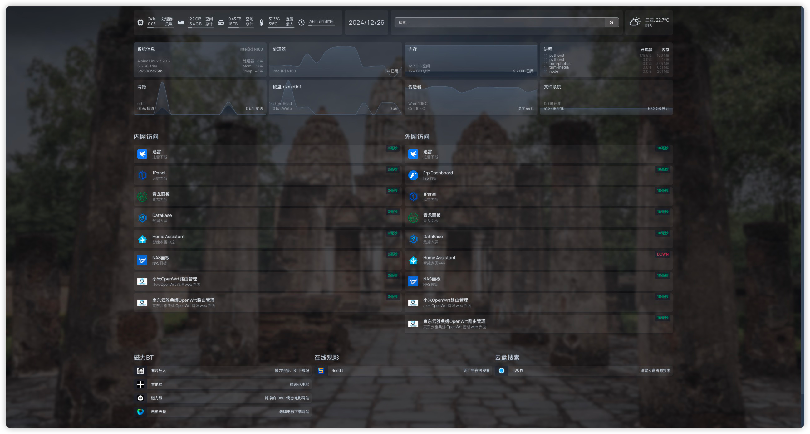

# 基于 HomePage 的配置文件
个人NAS的 Homepage 配置文件，供各位参考

# 使用方式
1. 安装 Homepage
2. 安装 glances 监控组件
```shell
docker run --name glances \
  -d --restart="always" \
  -p 61208-61209:61208-61209 \
  -e GLANCES_OPT="-w" \
  -v /opt/docker/glances/glances.conf:/glances/conf/glances.conf \
  -v /:/host:ro \
  -v /var/run/docker.sock:/var/run/docker.sock:ro \
  --pid host \
  nicolargo/glances:latest-full
```
3. 将配置下载替换到 Homepage 的配置文件

# 效果图展示
